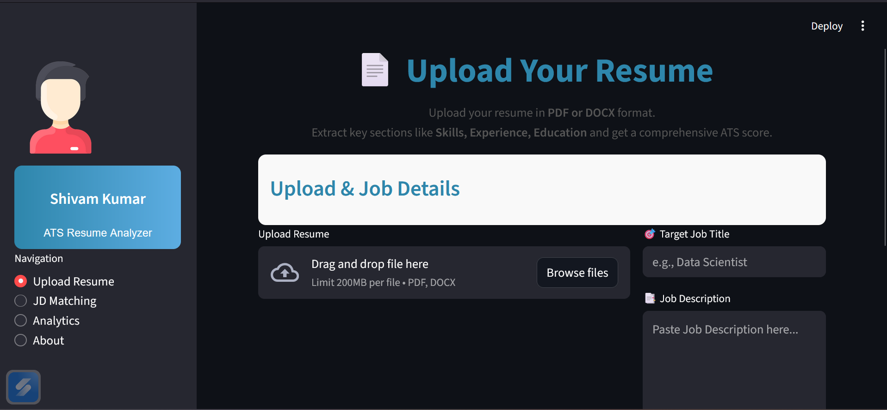
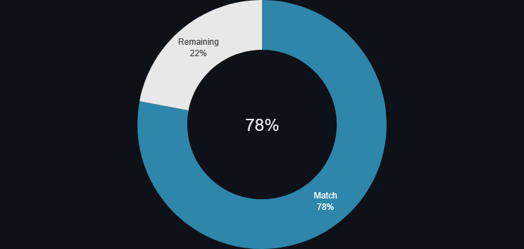
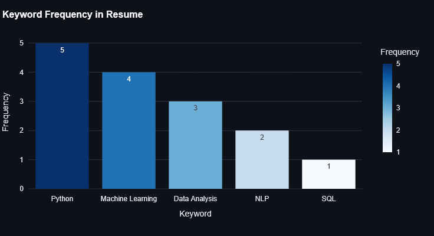

# 🧠 ATS Resume Analyzer (Streamlit + CrewAI)

[](https://www.python.org/)
[](https://streamlit.io/)
[](LICENSE)

---

## **Overview**

The **ATS Resume Analyzer** is a professional tool built with **Streamlit** and **CrewAI** that parses resumes (PDF/DOCX) and evaluates them against job descriptions. It provides **ATS-friendly scoring, keyword analysis, and actionable recommendations** to optimize resumes for Applicant Tracking Systems.

This project is designed like a **SaaS dashboard**, with modern UI/UX, interactive charts, and professional data visualization.

---

## **Features**

- Upload **PDF, DOCX, or TXT** resumes.
- Parse resumes into **Skills, Experience, Education**, and other key sections.
- Compare resume with a **Job Description**.
- Generate an **ATS score** with **breakdown metrics**:
  - Keywords matched
  - Structure
  - Metrics
  - Action verbs
  - Formatting
- Provide **quick wins** and improvement suggestions.
- Visualize results using:
  - **Donut charts** for overall score
  - **Bar charts** for keyword and skill distribution
  - **Progress bars** for quick insights
- Modular, production-ready, and extendable architecture.

---

## **Screenshots**

### **1. Upload Resume**


### **2. Resume Analytics**


### **3. Keyword Frequency**


---

## **Getting Started**

### 1. Clone the Repository
```bash
git clone https://github.com/shivamlko9832/ATS-Resume-Analyzer.git
cd ATS-Resume-Analyzer

---
```
### **2. Create & Activate Environment**
```bash
conda create -n crewai_agent python=3.10 -y
conda activate crewai_agent

---
```
### **3. Install Dependencies**
```bash
pip install -r requirements.txt

---
```
### **4. Run the App**
```bash
streamlit run streamlit_app.py

---
```
## **Project Structure**
```bash
ATS-Resume-Analyzer/
├── agents.py              # CrewAI agent definitions (parser, writer, evaluator, refiner)
├── streamlit_app.py       # Main Streamlit application
├── utils.py               # Utility functions for parsing, scoring, and charts
├── requirements.txt       # Python dependencies
├── screenshots/           # Screenshot images
│   ├── upload_resume.png
│   ├── resume_analytics.png
│   └── keyword_frequency.png
├── .env                   # Environment variables (not committed)
├── .gitignore
└── README.md
---
```
## **Usage**

1. **Upload your resume** (PDF/DOCX).  
2. **Provide a target Job Title and Job Description.**  
3. Click **Analyze Resume**.  
4. View results in tabs:  
   - 📄 **Cleaned Resume**  
   - ✨ **ATS-Optimized Resume**  
   - 🔹 **Refined Bullet Points**  
   - 📊 **ATS Score & Recommendations**  
5. **Download results** in TXT/DOCX format.


## **Contact**

👤 **Shivam Kumar**  

🔗 [LinkedIn](https://www.linkedin.com/in/shivamlko9832)  
💻 [GitHub](https://github.com/shivamlko9832)  


